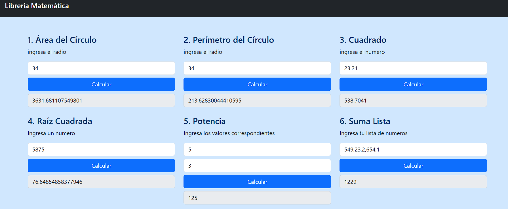
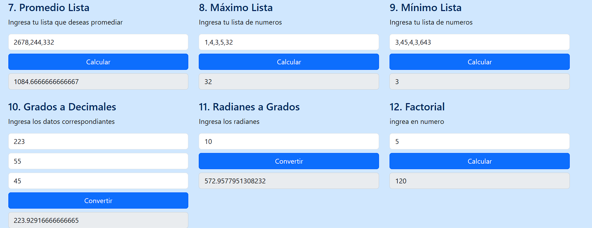
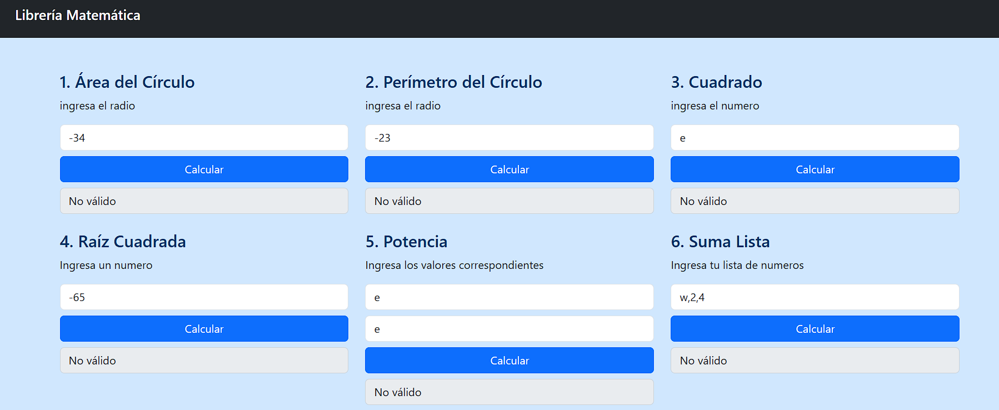

# libreria-matematica

**Librería de Utilidades Matemáticas en JavaScript**

**Integrantes del equipo:**
- Fatima Martinez Lopez
- Alary Guzman Jimenez

---
## Descripción

Esta librería ofrece funciones matemáticas comunes como cálculos de área, perímetro, potencias, raíces, operaciones con listas, conversiones de ángulos y factorial. Permite simplificar operaciones matemáticas en proyectos web sin depender de frameworks externos como React, Vue o similares.

---

## Instalación

Incluye el archivo de la librería en tu proyecto HTML de la siguiente forma:

```html
 <script src="libreria.js"></script>
````

---


## Ejemplo de Uso

A continuación se muestra cómo se implementa el cálculo del **Área de un Círculo** utilizando esta librería:

### Función en el `<script>` del HTML:

```html
<script>
  function calcularAreaCirculo() {
    const radio = parseFloat(document.getElementById("input1").value);
    document.getElementById("resultado1").value = Milib.areaCirculo(radio);
  }
</script>
```

---

### Estructura en el cuerpo del HTML:

```html
<div class="col-sm-4">
  <h4>1. Área del Círculo</h4>
  <p>Ingresa el radio</p>
  <input id="input1" class="form-control mb-2" type="number" placeholder="Radio">
  <button class="btn btn-primary mb-2" onclick="calcularAreaCirculo()">Calcular</button>
  <input id="resultado1" class="form-control" type="text" placeholder="Resultado" readonly>
</div>
```

---

### Llamado a la función desde la librería:

```js
const Milib = {
  areaCirculo: function (radio) {
    if (isNaN(radio) || radio <= 0) return "No válido";
    return Math.PI * Math.pow(radio, 2);
  },
  // ... otras funciones
};
```

---

## Nota

Esta es la misma forma en que se implementan el resto de las funciones de la librería, siguiendo la misma estructura:

 * Crear una función en el **<script>** que obtenga el valor desde un **input**.  
 * Llamar al método correspondiente de **Milib** para realizar el cálculo.  
 * Mostrar el resultado en un campo de solo lectura.  
Todas las funciones devuelven **"No válido"** si se ingresan datos incorrectos (como radios negativos, listas vacías o valores no numéricos).

---

## Funciones Disponibles

* `areaCirculo(radio)` → Devuelve el área de un círculo.
* `perimetroCirculo(radio)` → Devuelve el perímetro de un círculo.
* `cuadrado(numero)` → Eleva un número al cuadrado.
* `raizCuadrada(numero)` → Devuelve la raíz cuadrada (solo para números ≥ 0).
* `elevado(base, exponente)` → Devuelve la potencia de un número.
* `sumaLista(lista)` → Suma todos los elementos de una lista.
* `promedioLista(lista)` → Calcula el promedio de una lista de números.
* `maximoLista(lista)` → Devuelve el valor máximo de una lista.
* `minimoLista(lista)` → Devuelve el valor mínimo de una lista.
* `conversorGradosADecimales(grados, minutos, segundos)` → Convierte ángulos a decimales.
* `radianesAGrados(radianes)` → Convierte radianes a grados.
* `factorial(n)` → Calcula el factorial de un número entero positivo.

---

## Capturas de Pantalla

A continuación se muestran ejemplos del funcionamiento de la librería:




Resultado con Dato Inválido.



## Video

[🔗 Click aquí para ver el video de demostración en YouTube](https://youtu.be/b4sPsHCbRjg)

## GitHub Pages 


